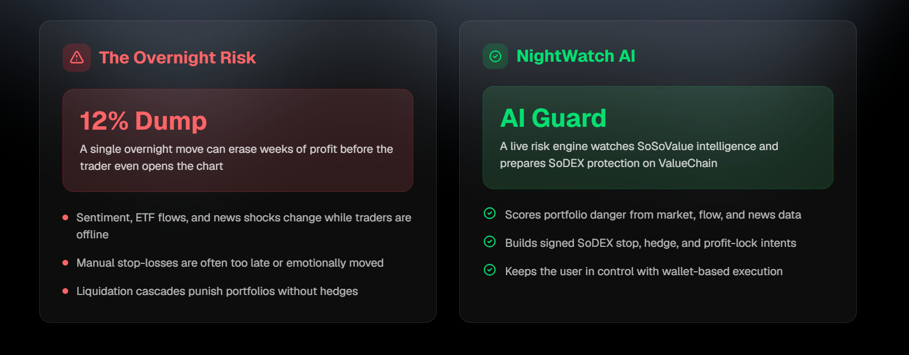

# NightWatch AI

Your AI crypto guardian while you sleep.

NightWatch AI is an autonomous overnight risk manager for crypto traders. It watches live market intelligence, turns that data into a Market Danger Score, explains the risk in plain language with OpenAI, and prepares wallet-approved SoDEX protection orders on ValueChain testnet.

The core promise is simple: activate Sleep Mode before going offline, let NightWatch monitor the market, then wake up to a clear report of what changed and what protection was prepared.

<p align="center">
  
</p>

<p align="center"><em>Markets never sleep. NightWatch scores overnight danger from live intelligence and prepares wallet-approved SoDEX protection before you wake up.</em></p>


## Project Goal

Crypto markets run 24/7, but traders do not. NightWatch AI solves the overnight risk problem by combining:

- SoSoValue as the intelligence layer for market snapshots, news, ETF flow pressure, sector rotation, SSI index breadth, and macro catalyst calendars.
- OpenAI as the reasoning and explanation layer for concise risk briefs.
- SoDEX as the execution layer for signed protection orders.
- ValueChain as the on-chain wallet and settlement environment.

The final Wave 3 version is designed to be demoable end-to-end: live data comes in, the dashboard computes risk, macro catalysts are surfaced, the AI brief explains what to do, the user reviews a dry-run, and only then can a configured SoDEX ValueChain testnet order be signed.

## Live User Flow

1. User opens `/dashboard`, `/risk`, `/execution`, or `/reports`.
2. User connects an EVM wallet as the dashboard login key.
3. NightWatch loads the wallet-scoped MongoDB profile, then syncs browser-local cache as a fallback.
4. NightWatch loads SoSoValue intelligence, SoSoValue Macro events, and SoDEX testnet market routes.
5. The risk engine computes a Market Danger Score and explains which signals are driving it.
6. OpenAI creates a trader-friendly risk brief when `OPENAI_API_KEY` is configured. If no key is present, the app uses a labeled deterministic brief.
7. User picks a protection mode: Safe, Balanced, or Aggressive.
8. User switches/adds ValueChain testnet when signing is needed.
9. NightWatch creates a dry-run preview for the selected SoDEX route.
10. User signs the EIP-712 `ExchangeAction` only after the dry-run matches the selected market and the SoDEX spot verifying contract is configured.
11. The server validates and submits the signed testnet order to SoDEX.

NightWatch never silently trades. Every protection order requires a matching dry-run and wallet approval.

## Tech Stack

- Next.js 15.5.18 App Router, React 18, TypeScript
- Tailwind CSS with the NightWatch animation, layout, motion, image, and color system preserved
- Framer Motion, lucide-react, shadcn-style UI components
- SoSoValue OpenAPI for market snapshots, hot news, ETF history, sector spotlight, SSI indexes, and macro events
- OpenAI Responses API for the dashboard risk brief
- SoDEX REST API on ValueChain testnet for symbols, tickers, account state, and signed spot orders
- ValueChain testnet EIP-712 wallet signatures
- viem for payload hashing

## Environment

Create `.env.local` from `.env.example`:

```bash
SOSOVALUE_API_KEY=your_sosovalue_api_key_here
SOSOVALUE_BASE_URL=https://openapi.sosovalue.com/openapi/v1
NIGHTWATCH_TRACKED_SYMBOLS=BTC,ETH,SOL,LINK
NIGHTWATCH_ETF_COUNTRY_CODES=US,HK
NIGHTWATCH_SSI_INDEX_LIMIT=2
NIGHTWATCH_MACRO_LOOKAHEAD_DAYS=7
OPENAI_API_KEY=your_openai_api_key_here
OPENAI_MODEL=gpt-5.4-mini
OPENAI_RESPONSES_URL=https://api.openai.com/v1/responses
SODEX_SPOT_BASE_URL=https://testnet-gw.sodex.dev/api/v1/spot
SODEX_PERPS_BASE_URL=https://testnet-gw.sodex.dev/api/v1/perps
NEXT_PUBLIC_SODEX_SPOT_VERIFYING_CONTRACT=your_sodex_spot_eip712_verifying_contract
NIGHTWATCH_REQUEST_TIMEOUT_MS=12000
NIGHTWATCH_ALLOWED_ORIGINS=http://localhost:3000,https://your-deployment.example
NIGHTWATCH_API_TOKEN=optional_server_to_server_demo_token
NIGHTWATCH_DRY_RUN_SECRET=replace_with_a_random_32_byte_secret
MONGODB_URI=your_mongodb_uri_here
NIGHTWATCH_PERSISTENCE_DB=nightwatchai
NIGHTWATCH_PERSISTENCE_COLLECTION=wallet_profiles
TELEGRAM_BOT_TOKEN=your_telegram_bot_token_here
TELEGRAM_CHAT_ID=your_telegram_chat_id_here
EMAIL_ALERT_WEBHOOK_URL=your_email_webhook_url_here
ALERT_WEBHOOK_URL=your_generic_alert_webhook_url_here
```

`SOSOVALUE_API_KEY`, `OPENAI_API_KEY`, `MONGODB_URI`, Telegram, and email/webhook credentials are only read server-side. Mutating API routes enforce same-origin or `NIGHTWATCH_API_TOKEN` access, apply lightweight rate limits, and SoDEX submits require a signed dry-run receipt from `NIGHTWATCH_DRY_RUN_SECRET`. Provider fallbacks are explicitly labeled when live providers rate-limit or are not configured, and fallback market routes do not fabricate executable prices.

SoSoValue reads are deduped and cached briefly on the server to reduce API-key burn during dashboard refreshes. If SoSoValue rate-limits after a recent live read, NightWatch can serve a short stale cache window; otherwise it switches to a clearly labeled deterministic fallback. The public intelligence route also has a lightweight per-client read limit so one browser cannot burn the SoSoValue key.

### Credential Safety

- Do not commit `.env.local`; it is ignored by Git.
- Rotate any OpenAI or SoSoValue key that has been pasted into a chat, issue tracker, screenshot, or public log.
- `NIGHTWATCH_DRY_RUN_SECRET` should be a random 32-byte-or-longer secret in production.
- `NIGHTWATCH_API_TOKEN` is optional for same-origin browser use, but useful for server-to-server demo scripts.
- `MONGODB_URI` powers wallet-scoped server persistence. Rotate the database password if the URI has ever been pasted into chat or logs.
- `NEXT_PUBLIC_SODEX_SPOT_VERIFYING_CONTRACT` must be the real SoDEX spot EIP-712 verifying contract before signed spot submission is enabled. If it is empty or zero-address, NightWatch allows dry-runs but blocks wallet signing.

### SoDEX Execution Requirements

NightWatch can always create a dry-run preview from live SoDEX market data. Real SoDEX submission additionally requires:

- A ValueChain testnet wallet.
- A SoDEX account ID.
- A registered SoDEX API key name. SoDEX's `X-API-Key` header expects this key name, not a private key.
- The connected signing wallet must correspond to the registered API key used for the trading action.
- `NEXT_PUBLIC_SODEX_SPOT_VERIFYING_CONTRACT` must be configured for the active SoDEX spot signing domain.

The submit route rejects stale or mismatched previews by checking the signed dry-run receipt against the submitted `symbolID`, quantity, endpoint, and venue before forwarding to SoDEX.

## Run Locally

```bash
corepack pnpm install
corepack pnpm dev
```

Open:

- Homepage: `http://localhost:3000`
- Dashboard: `http://localhost:3000/dashboard`

## Deploy on Vercel

The repo is a standard Next.js app and can be deployed with Vercel CLI:

```bash
corepack pnpm install
corepack pnpm lint
corepack pnpm build
vercel env add SOSOVALUE_API_KEY production
vercel env add NIGHTWATCH_TRACKED_SYMBOLS production
vercel env add NIGHTWATCH_ETF_COUNTRY_CODES production
vercel env add NIGHTWATCH_SSI_INDEX_LIMIT production
vercel env add NIGHTWATCH_MACRO_LOOKAHEAD_DAYS production
vercel env add OPENAI_API_KEY production
vercel env add NIGHTWATCH_DRY_RUN_SECRET production
vercel env add NEXT_PUBLIC_SODEX_SPOT_VERIFYING_CONTRACT production
vercel env add MONGODB_URI production
vercel --prod
```

For production, configure the full environment set from `.env.example`. Vercel stores production and preview env values as sensitive by default, so keep secrets in Vercel env vars instead of source files.

Current Wave 3 production alias:

- https://nightwatchai.vercel.app

Before deployment, validate with:

```bash
corepack pnpm lint
corepack pnpm build
corepack pnpm audit --audit-level moderate
```

The final Wave 3 build is checked with `pnpm audit`, `pnpm lint`, `pnpm build`, and a production-server API smoke against `/api/nightwatch/intel` to verify the macro contract and fallback path.

## Wave 1: Shipped Now

- NightWatch landing experience now uses the NightWatch visual flow, animations, colors, rounded glass navigation, carousel motion, and section rhythm without the old template branding.
- Dedicated `/dashboard` route for the live Wave 1 console.
- Live NightWatch Console with portfolio value controls and Safe, Balanced, and Aggressive protection modes.
- SoSoValue-backed intelligence route for BTC, ETH, SOL, LINK, hot news, ETF flow pressure, and sector rotation.
- Deterministic Market Danger Score with explainable signals and recommended protection actions.
- OpenAI risk brief route using the Responses API, plus deterministic fallback when no OpenAI key is configured.
- SoDEX ValueChain testnet market route using live testnet symbols and tickers.
- Wallet connection, ValueChain testnet network switch/add flow, and SoDEX account-state lookup.
- EIP-712 signing path for a SoDEX spot `batchNewOrder` protection payload.
- Server route to submit the signed SoDEX testnet protection order after wallet approval.
- Protection simulator for overnight drawdown and estimated loss reduction.
- Legacy template route and unused demo components have been removed so the shipped app surface stays NightWatch-only.

## Wave 2: Shipped Now

Wave 2 focuses on the exact judge gap from Wave 1: prove live ingestion, make execution flow observable, and show why the Market Danger Score is trustworthy.

- Persistent browser-local portfolios, risk profile, alert preferences, Sleep Mode sessions, risk snapshots, dry-runs, alert history, and signed-order audit history. No wallet private keys or API secrets are stored in the browser.
- Wallet login added for dashboard access. The connected EVM address is the profile key for MongoDB-backed server persistence.
- MongoDB-backed persistence added for wallet-scoped settings, Sleep Mode sessions, alert history, dry-runs, and signed-order audit history, with browser-local storage retained as cache/fallback.
- SoSoValue integration upgraded from fixed currency IDs to `/currencies` discovery, documented ETF flow parameters, live hot news, sector spotlight, and transparent fallback reasons.
- SoSoValue Indexes support added through `/indices`, `/indices/{index_ticker}/market-snapshot`, and `/indices/{index_ticker}/constituents`, with SSI breadth included in the Market Danger Score and source snippets.
- Market Danger Score now returns score components, evidence, and stress scenarios for ETF outflow cascades, narrative rotation breaks, and false-positive news shocks.
- OpenAI briefs now receive SoSoValue/SSI/SoDEX source snippets, score components, and validation scenarios, and the UI shows the cited source snippets beside the brief.
- Telegram, email/webhook, browser, and console alert flow added. Telegram/email deliver only when server-side env vars are configured; otherwise the app records queued/preview events honestly.
- Wallet-safe dry-run mode added. Users must create a dry-run preview before signing, and every order record is persisted in the local audit history.
- SoDEX perps monitoring route added for live testnet perps tickers, mark prices, account position reads, and dry-run hedge/leverage/TP-SL preparation.
- Strategy templates added: capital preservation, profit lock, volatility hedge, and narrative rotation.
- Morning report panel added with copy-to-clipboard summary of active Sleep Mode session, latest score, alerts, order records, and AI brief.
- Production hardening completed: TypeScript build errors are no longer ignored, Next.js is upgraded to the patched 15.5.18 line, React is aligned to the supported 18.x peer range, ESLint runs through the CLI, and external endpoints/timeouts are env-overridable.
- Production audit fixes added: `pnpm audit` is clean, transitive PostCSS is forced to the patched line, `mathjs` was removed from the old blur component, signed-order payloads are validated server-side, dry-runs must carry a signed server receipt and match the submitted SoDEX order before execution, invalid wallet/account/API-key-name inputs are rejected, mutating routes are guarded and rate-limited, persistence payloads are validated and bounded before MongoDB writes, SoDEX quantities are rounded to symbol precision/step/min-notional filters, SoSoValue reads are cached/deduped to reduce rate-limit pressure, Vercel Speed Insights is only injected in Vercel runtime, and fallback provider data no longer uses hardcoded market prices.
- UI/UX cleanup completed with Risk, Execution, and Reports tabs so Wave 2 controls are not crowded into a single distorted page.
- App structure split into focused pages: `/dashboard`, `/risk`, `/execution`, `/reports`, and `/roadmap`.

## Wave 3: Final Production Pass

Wave 3 turns the demo into a tighter production-ready app surface: live risk data remains honest, SoSoValue rate limits are respected, the UI exposes the new catalyst data clearly, and on-chain signing is blocked unless the deployment has the correct SoDEX EIP-712 domain configured.

- Added SoSoValue Macro support through `/macro/events`. Upcoming macro catalysts are normalized, bounded to `NIGHTWATCH_MACRO_LOOKAHEAD_DAYS`, shown in the Risk tab, included in the morning report, and cited in source snippets.
- Added macro catalyst pressure to the Market Danger Score with a capped contribution so calendar risk can raise alerts without overwhelming spot, ETF, news, sector, and SSI signals.
- Added env-driven SoSoValue tracked assets through `NIGHTWATCH_TRACKED_SYMBOLS`, replacing fixed server-only tracked symbols while keeping BTC, ETH, SOL, and LINK as production defaults.
- Added env-driven ETF country coverage through `NIGHTWATCH_ETF_COUNTRY_CODES`, with US and Hong Kong (`US,HK`) enabled by default for China/HK readiness.
- Added `NIGHTWATCH_SSI_INDEX_LIMIT` so deployments can tune SSI breadth requests against the documented SoSoValue rate limit.
- Added read-side rate limiting on `/api/nightwatch/intel` to protect the server-side SoSoValue key from refresh abuse.
- Added ValueChain signing-domain readiness checks. Dry-runs still work, but signed SoDEX spot submission is disabled until `NEXT_PUBLIC_SODEX_SPOT_VERIFYING_CONTRACT` is set to a real contract address.
- Added an Execution tab signing-domain card so operators can see whether EIP-712 signing is production-ready before pressing the wallet approval button.
- Pinned `outputFileTracingRoot` in `next.config.mjs` so production builds do not infer the parent Windows home directory when another lockfile exists outside the repo.
- Updated `.env.example` and this README with all final Wave 3 environment variables, deploy steps, demo flow, and documentation references.

## Demo Script

1. Open `/dashboard` and connect an EVM wallet to unlock the dashboard.
2. Confirm the source badges show SoSoValue, SSI indexes, Macro calendar, SoDEX spot, SoDEX perps, OpenAI, and MongoDB profile status. Rate-limit or credential fallbacks are labeled in the console status line.
3. In the Risk tab, read the Market Danger Score, score components, SoSoValue macro catalyst calendar, stress scenarios, source snippets, and OpenAI risk brief.
4. In the Execution tab, switch Safe/Balanced/Aggressive modes and strategy templates, adjust portfolio value and alert threshold, and enable browser notifications.
5. Create a SoDEX spot dry-run preview before signing. The sign button stays blocked until a dry-run exists.
6. Connect the registered signing wallet, add/switch to ValueChain testnet, confirm the EIP-712 signing-domain card is configured, enter or load a SoDEX account ID, enter the SoDEX API key name, then sign the approved testnet protection order.
7. Create a SoDEX perps dry-run hedge and show live perps tickers/mark prices. Perps signing remains preview-only until the leverage and TP/SL signing path is fully confirmed.
8. In the Reports tab, show persisted Sleep Mode snapshots, queued/sent alerts, dry-run/order history, and copy the morning report.
9. Show that the app refuses to submit if wallet, account, route, dry-run context, API key name, or the SoDEX spot verifying contract is missing.

## On-chain Execution Notes

NightWatch prepares a SoDEX ValueChain testnet payload, computes the SoDEX EIP-712 `ExchangeAction`, asks the wallet to sign it, prefixes the signature for SoDEX, and submits through the server route. Signed submission is only enabled when the SoDEX spot verifying contract is configured, which keeps the final build real and on-chain while preserving user approval.

## Documentation References

- SoSoValue API: https://sosovalue-1.gitbook.io/sosovalue-api-doc
- SoSoValue Rate Limit: https://sosovalue-1.gitbook.io/sosovalue-api-doc/rate-limit
- SoSoValue Index API: https://sosovalue-1.gitbook.io/sosovalue-api-doc/3.-sosovalue-index/index
- SoSoValue Macro: https://sosovalue-1.gitbook.io/sosovalue-api-doc/8.-macro/macro
- SoSoValue Indexes: https://ssi.sosovalue.com/en
- SoDEX docs: https://sodex.com/documentation
- OpenAI Responses API: https://platform.openai.com/docs/api-reference/responses
- OpenAI text generation guide: https://platform.openai.com/docs/guides/text
